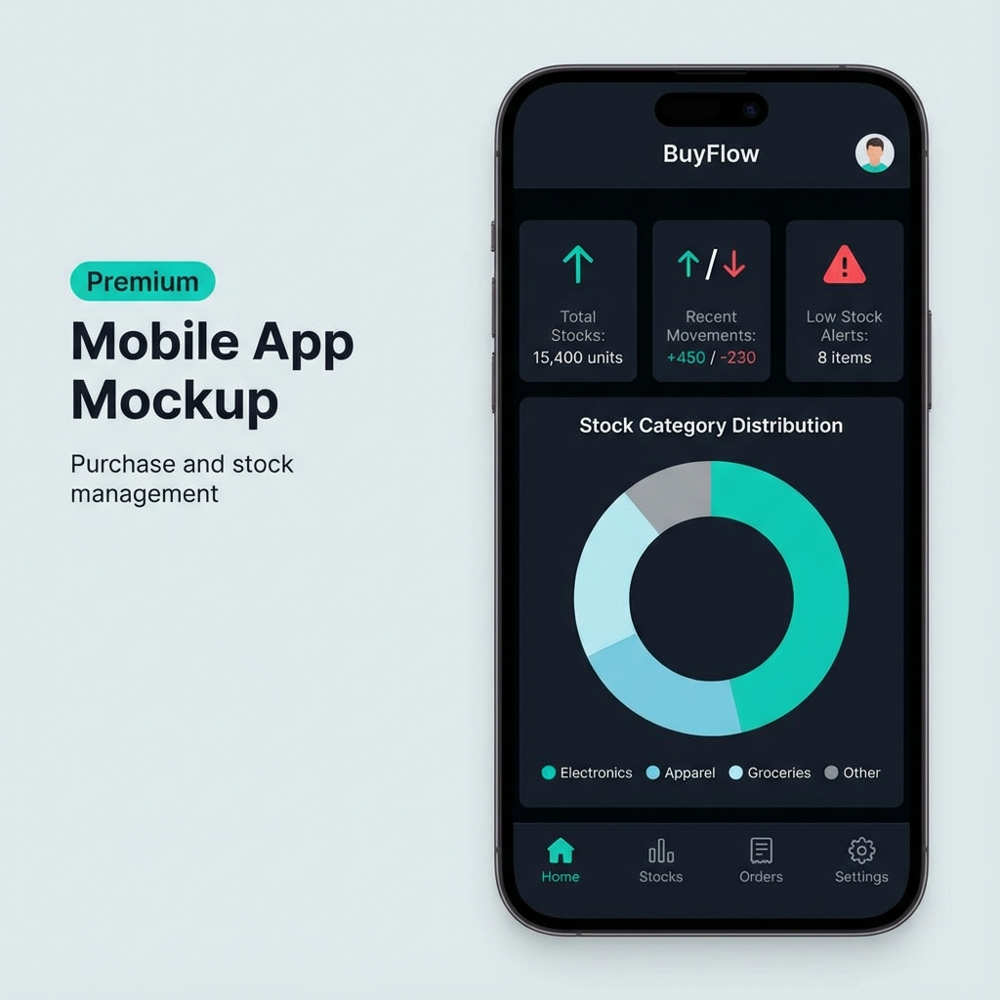

# 🛒 BuyFlow - Unified Purchase & Stock Management

[](https://flutter.dev)
[](https://spring.io/projects/spring-boot)
[](https://www.mysql.com/)
[](LICENSE)

**BuyFlow** est une solution complète et moderne de gestion des achats et des stocks. Elle combine une interface mobile intuitive développée avec **Flutter** et un backend robuste et sécurisé propulsé par **Spring Boot**.



---

## 🚀 Fonctionnalités Clés

### 📱 Application Mobile (Frontend)
- **Tableau de Bord Dynamique** : Visualisation en temps réel des statistiques de stock via des graphiques interactifs (`fl_chart`).
- **Gestion des Produits** : Consultation, ajout et modification des produits avec catégories.
- **Mouvements de Stock** : Suivi précis des entrées et sorties de marchandises.
- **Authentification Sécurisée** : Connexion, inscription, et récupération de mot de passe (JWT).
- **Multi-langue** : Support complet du Français et de l'Anglais.

### ⚙️ Backend (API)
- **Architecture REST** : API propre et documentée pour une intégration fluide.
- **Sécurité Avancée** : Protection des endpoints via **Spring Security** et **JWT**.
- **Gestion des Fournisseurs** : Base de données centralisée pour tous les acteurs du flux d'achat.
- **Facturation & Règlements** : Module complet pour le suivi financier des transactions.
- **Statistiques** : Endpoints dédiés pour agréger les données de stock et de performance.

---

## 🛠️ Stack Technique

| Composant | Technologie |
| :--- | :--- |
| **Frontend** | Flutter, Riverpod (State Management), GoRouter, Dio (HTTP), Google Fonts |
| **Backend** | Java 17, Spring Boot 2.5.3, Spring Security, JPA/Hibernate, Maven |
| **Base de Données** | MySQL |
| **Authentification** | JWT (JSON Web Token), OAuth2 (Google integration ready) |
| **Documentation API**| Swagger / Springfox |

---

## 📥 Installation et Exécution

### 1. Backend (Spring Boot)
1. **Prérequis** : Java 17+, MySQL 8.0+.
2. **Configuration** : Modifiez le fichier `backend-springboot/src/main/resources/application.properties` avec vos identifiants MySQL.
   ```properties
   spring.datasource.url=jdbc:mysql://localhost:3306/buyflow?createDatabaseIfNotExist=true
   spring.datasource.username=VOTRE_USER
   spring.datasource.password=VOTRE_PASSWORD
   ```
3. **Lancement** :
   ```bash
   cd backend-springboot
   ./mvnw spring-boot:run
   ```
   *L'API sera accessible sur : `http://localhost:9091`*

### 2. Frontend (Flutter)
1. **Prérequis** : Flutter SDK (3.10+).
2. **Dépendances** :
   ```bash
   cd frontend-flutter
   flutter pub get
   ```
3. **Lancement** :
   ```bash
   flutter run
   ```

---

## 🔌 API Utiles (Aperçu)

### Authentification (`/api/auth`)
- `POST /login` : Connexion et obtention du token JWT.
- `POST /register` : Création de compte.
- `POST /forgot-password` : Demande de réinitialisation.

### Gestion des Stocks (`/stocks`)
- `GET /` : Liste complète des stocks.
- `GET /stats` : Statistiques globales (Total produits, alertes stock bas).
- `POST /` : Ajouter un nouvel emplacement de stock.

### Produits (`/produits`)
- `GET /` : Liste de tous les produits.
- `POST /` : Ajouter un produit.

> [!TIP]
> Accédez à la documentation interactive **Swagger** une fois le serveur lancé sur : `http://localhost:9091/swagger-ui/`

---

## 📝 Auteur
Développé avec passion pour simplifier les flux d'achats. 🚀
