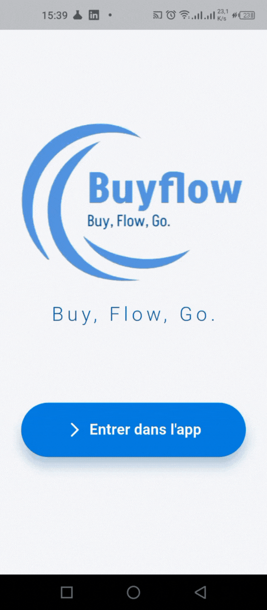

# BuyFlow 🚀

[](https://www.oracle.com/java/)
[](https://spring.io/projects/spring-boot)
[](https://flutter.dev/)
[](https://dart.dev/)
[](http://creativecommons.org/publicdomain/zero/1.0/)

**BuyFlow** is a comprehensive full-stack application designed for efficient purchase and inventory management. It combines a robust **Spring Boot** backend with a responsive **Flutter** mobile frontend, enabling users to manage their business operations on the go.

## 🌟 Features

*   **🔐 User Authentication**: Secure login and access control.
*   **📦 Stock Management**: Advanced inventory tracking with real-time updates and audit trails.
*   **💸 Purchase Management**: Handle supplier invoices, payments, and product sourcing.
*   **👥 Partner Management**: Maintain records of suppliers (Fournisseurs) and operators.
*   **📡 REST API**: Full-featured API for integrations and data management.
*   **📱 Cross-Platform**: Native-like experience on Android and iOS.

## 🏗️ Architecture

The project follows a clean separation of concerns:

| Layer | Technology | Description |
| :--- | :--- | :--- |
| **Backend** | **Spring Boot** (Java) | Hosts the REST API, business logic, and database interactions. |
| **Frontend** | **Flutter** (Dart) | Provides the mobile user interface. |
| **Database** | **MySQL** | Persistent storage for all application data. |

## 📂 Project Structure

```bash
BuyFlow/
│── backend-springboot/    # Spring Boot application (API)
│── frontend-flutter/      # Flutter mobile application
│── docs/                  # Detailed documentation
│   ├── API_REFERENCE.md   # API Endpoints and usage
│   └── STOCK_MODULE.md    # Deep dive into Stock mechanics
│── utils/                 # Utilities and assets
│── README.md              # Project entry point
```

## 🚀 Getting Started

### Prerequisites

*   [Git](https://git-scm.com/)
*   [Java JDK 17+](https://adoptium.net/)
*   [Flutter SDK](https://docs.flutter.dev/get-started/install)
*   [MySQL Server](https://dev.mysql.com/downloads/mysql/)

### 1. Clone the Repository

```bash
git clone https://github.com/Chahra123/BuyFlow.git
cd BuyFlow
```

### 2. Backend Setup (Spring Boot)

1.  Navigate to the backend directory:
    ```bash
    cd backend-springboot
    ```
2.  Configure your database settings in `src/main/resources/application.properties` (if needed).
3.  Run the application:
    ```bash
    ./mvnw spring-boot:run
    # Windows
    mvnw spring-boot:run
    ```
    The API will start at `http://localhost:9091`.

### 3. Frontend Setup (Flutter)

1.  Navigate to the frontend directory:
    ```bash
    cd frontend-flutter
    ```
2.  Install dependencies:
    ```bash
    flutter pub get
    ```
3.  Run the app:
    ```bash
    flutter run
    ```

## 📚 Documentation

Detailed documentation is available in the `docs/` folder:

*   **[📖 API Reference](docs/API_REFERENCE.md)**: Explore the available endpoints for Products, Stocks, Invoices, etc.
*   **[📦 Stock Module Details](docs/STOCK_MODULE.md)**: Understand the logic behind stock movements and integrity rules.

## 📸 Demo

*Stock Management in action:*

<p align="center">
  
</p>

## 🤝 Contributing

Contributions are welcome!
1.  Fork the repository.
2.  Create a feature branch (`git checkout -b feature/amazing-feature`).
3.  Commit your changes (`git commit -m 'Add amazing feature'`).
4.  Push to the branch (`git push origin feature/amazing-feature`).
5.  Open a Pull Request.

## 📄 License

This project is licensed under the **CC0-1.0 Public Domain** license.
